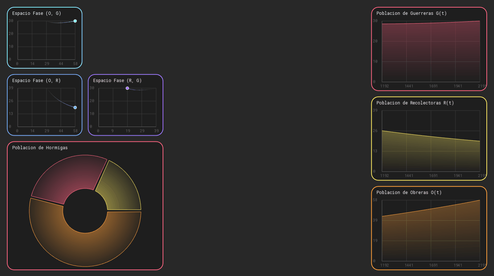
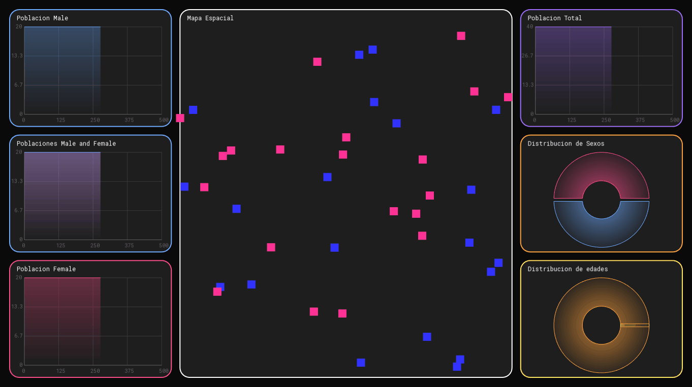

# DynSysVis RT - Dynamical System Visualizer Real-Time


**DynSysVis RT** 
es una herramienta (en desarrollo) para la visualización de datos en tiempo real y análisis de sistemas dinámicos desarrollada en C++ utilizando la biblioteca SFML. 

Está diseñada para integrarse fácilmente en simulaciones complejas, permitiendo monitorear mediante gráficas temporales y retratos de fase.
**Ajustando tamaños** y **posiciones** muy facilmente usando un **sistema de panales** implementados por mi

# DynSysVis RT

[](https://angelmanuelgl.github.io/proyectos/DynSysVis/)
[](https://github.com/angelmanuelgl/DynSysVis)

## Caracteristicas
* **Visualización en Tiempo Real**: Gráficas de evolución temporal con sombreado de degradado (gradient fill).
* **Análisis de Espacio Fase**: Gráficas de trayectoria (X vs Y) para estudio de sistemas dinámicos.
* **Interfaz Adaptativa**: Paneles con bordes redondeados y títulos dinámicos que ajustan el área de dibujo automáticamente.
* **Arquitectura Extensible**: Basada en herencia para facilitar la creación de nuevos tipos de visualizaciones.


## Ejemplos de Uso: 

**Sistema de ecuaciones Diferenciales (Modelo De Colonia de Hormigas)**

     


   


**Ecuaciones Diferenciales De Segundo Orden (Pendulo Simple con resistencia al aire)**


**Procesos Estocasticos (SpatialBranchingProcesses)**




## MAS Ejemplos de Uso: 


**ECUACIONES DIFERENCIALES ORDINARIAS (EDOS)** 
* Dinámica de Poblaciones: Visualización en tiempo real de modelos de crecimiento (Malthus, Logístico).
* Cinética Química: Monitoreo de la concentración de reactivos y productos en una reacción.
* Modelos Epidemiológicos: Seguimiento de curvas SIR (Susceptibles, Infectados, Recuperados) durante una simulación.

**SISTEMAS DE EDOS (SISTEMAS ACOPLADOS)**  | Gracias al sistema de Paneles Adaptativos, puedes monitorear múltiples variables interdependientes simultáneamente.
* Ecología Competitiva: Modelos de Depredador-Presa (Lotka-Volterra)
* Circuitos Eléctricos: Análisis de redes complejas (Leyes de Kirchhoff) donde varias corrientes y voltajes varían a la vez.
* Sistemas de Control: Visualización de la respuesta de un controlador ante perturbaciones externas.

**ECUACIONES DIFERENCIALES DE SEGUNDO ORDEN** |  Permite generar Retratos de Fase (Posición vs. Velocidad).
* Mecánica Clásica: Simulación de osciladores armónicos, péndulos simples y dobles (con o sin resistencia del aire).
* Vibraciones Mecánicas: Análisis de amortiguamiento en estructuras o sistemas de suspensión.
* Circuitos RLC: Comportamiento de la carga y corriente en circuitos con inductores y capacitores.

**PROCESOS ESTOCÁSTICOS Y PROBABILÍSTICOS** 
* Biología Matemática: Procesos de ramificación como el de Dalton-Watson
* Cadenas de Markov: Visualización de la evolución de estados en sistemas probabilísticos.
F* nanzas Cuantitativas: Modelado de caminatas aleatorias o movimiento browniano para simular fluctuaciones de mercado.


## Requisitos
* Compilador de C++ (GCC/MinGW recomendado).
* [SFML](https://www.sfml-dev.org/) (Simple and Fast Multimedia Library) instalada y configurada.

## 📂 Estructura del Proyecto

* `lib_grafica/`: La libreria en si, aqui esta todo el funcionamiento
* `apps/`: Experimentos y simulaciones que utilizan la librería.
* `assets/`: Recursos compartidos (Fuentes como Roboto, archivos de configuración).
* `build/`: Directorio para ejecutables y archivos objeto.


## 🚀 Instrucciones de Compilación

### Usando MakeFIle

Para faciliatar esto puedes usar makefile, solo asegurate de tener instalado ``pacman -S mingw-w64-ucrt-x86_64-make``

Una vez que ejecutas ``mingw32-make`` dentro de DynSysVis, se genera el archivo lib/libDynSysVis.a
Para usar el modo log usar ``mingw32-make LOG=1 ``

Yo me encargo de que el makefile siempre funcione apesar de los cambios en carpetas y etc

luego compilar  proyectos con
```
mingw32-make run APP=apps/ejemplos/hormigas.cpp
```

```
mingw32-make run APP=apps/pendulo/pendulo.cpp
mingw32-make run APP=apps/pendulo/penduloOld.cpp
mingw32-make run APP=apps/pendulo/penduloFase.cpp

mingw32-make run APP=apps/hormigas/main.cpp
mingw32-make run APP=apps/hormigas/hormigasFase.cpp

mingw32-make run APP=apps/pruebasFast/pruebas.cpp

mingw32-make run APP=apps/mix/lor.cpp
mingw32-make run APP=apps/mix/sir.cpp
```


## algunas visualizaciones externas
